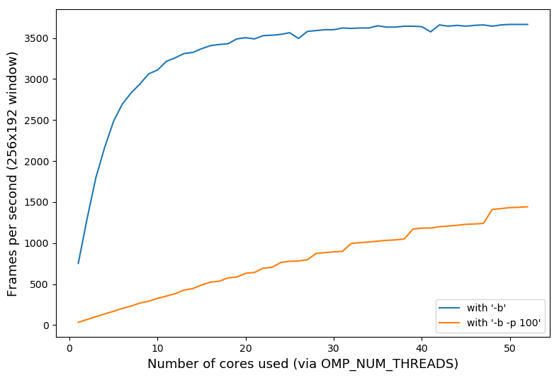

In the Reddit/programming thread about MandelbrotSSE (https://bit.ly/3AXdqG2),
user /u/JanneJM asked me about the scaling performance of my code.

I knew what was going on, since
[I've seen it before;](https://www.thanassis.space/straylight.html#Memory_bandwidth_and_scalability)
...but I wanted to confirm my theory.

The diagram above was generated by [a script](scaling.py) I wrote,
that processes and plots the logs generated by two test executions:

- One (blue line) with normal benchmarking (i.e. option '-b')
- One (red line) with option "-p 100" set, in addition to '-b'.

The use of '-p 100' tells my code to reuse NOTHING from the previous frame;
and recompute each and every pixel. This means we no longer run the Xaos
algorithm - we use the pure AVX ('-v', default) implementation of the
Mandelbrot loop on EVERY SINGLE PIXEL, so we become completely CPU
bound.

By default, '-p' is set to 0.75, which means only 0.75% pixels are
actually computed; the rest (99.25%) are copied from the previous frame,
making the process memory-bandwidth-bound, not CPU-bound. This is
why by default we run so fast! But that also means we don't scale
linearly with more cores - memory bandwidth is, still, the final
frontier in computer architectures (as of 2022).

Today, I managed to run my code in a machine with 64 cores, 52 of
which were allocated to me; and I run the following two series of
commands, controlling the number of CPUs used via the environment
variable `OMP_NUM_THREADS`:

    for ((i=1; i<=$(nproc); i++)); do
       printf "%02d thread(s): " $i
       OMP_NUM_THREADS=$i SDL_VIDEODRIVER=dummy ./src/mandelSSE -b 256 192 |& grep Frames/
    done | tee log.txt

    for ((i=1; i<=$(nproc); i++)); do
       printf "%02d thread(s): " $i
       OMP_NUM_THREADS=$i SDL_VIDEODRIVER=dummy ./src/mandelSSE -b -p 100 256 192 |& grep Frames/
    done | tee log2.txt

This generated output that looks like this:

    01 thread(s): [-] Frames/sec: 752.98
    02 thread(s): [-] Frames/sec: 1297.00
    03 thread(s): [-] Frames/sec: 1799.12
    04 thread(s): [-] Frames/sec: 2168.13
    ...

The plot shown above was generated from this data (in files [log.txt](log.txt)
and [log2.txt](log2.txt)) and fully confirmed my understanding. The difference
in performance between the Xaos algorithm and the "naive" Mandelbrot
computation is quite clear;  but what is also clear is how the 
latter, being CPU-bound, benefits linearly by the increase of
available cores. In contrast, the Xaos version very quickly 
"saturates" the available memory bandwidth, and the additional
cores just "fight" to get access to the limited available memory speed.

/u/JanneJM, I hope this answers your doubts!

Thanassis.
